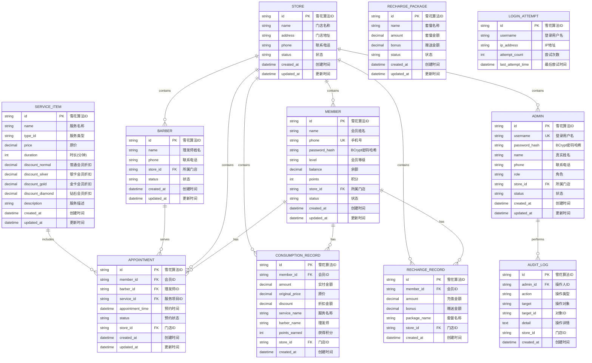
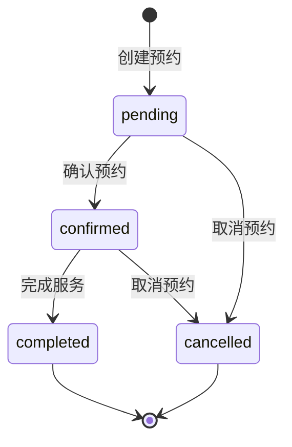

# MembershipSystem - 数据库设计文档

> 会员管理系统数据库设计与说明文档

---

## 📋 目录

- [数据库概览](#数据库概览)
- [ER 图](#er-图)
- [表结构详解](#表结构详解)
- [索引设计](#索引设计)
- [SQL 建表脚本](#sql-建表脚本)
- [初始化数据](#初始化数据)
- [数据库管理](#数据库管理)

---

## 数据库概览

### 数据库基本信息

| 项目 | 内容 |
|------|------|
| **数据库类型** | MySQL 8.0+ |
| **字符集** | utf8mb4 |
| **排序规则** | utf8mb4_unicode_ci |
| **存储引擎** | InnoDB（支持事务） |
| **主键策略** | 雪花算法（Snowflake ID） |
| **ORM 框架** | MyBatis-Plus 3.5.12 |
| **逻辑删除** | 使用 status 字段标识 |

### 表清单

| 表名 | 说明 | 核心字段数 | 关联表 |
|------|------|-----------|--------|
| `member` | 会员表 | 12 | store |
| `store` | 门店表 | 6 | - |
| `barber` | 理发师表 | 7 | store |
| `service_item` | 服务项目表 | 13 | - |
| `appointment` | 预约表 | 9 | member, barber, service_item, store |
| `consumption_record` | 消费记录表 | 10 | member, store |
| `recharge_record` | 充值记录表 | 7 | member, store |
| `recharge_package` | 充值套餐表 | 6 | - |
| `admin` | 管理员表 | 9 | store |
| `audit_log` | 审计日志表 | 7 | admin |
| `login_attempt` | 登录尝试表 | 5 | - |

---

## ER 图



---

## 表结构详解

### 1. 会员表（member）

会员核心信息表，存储会员基本资料、等级、余额和积分。

```sql
CREATE TABLE `member` (
    `id`           VARCHAR(64)    NOT NULL  COMMENT '雪花算法生成的唯一ID',
    `name`         VARCHAR(100)   NOT NULL  COMMENT '会员姓名',
    `phone`        VARCHAR(20)    NOT NULL  COMMENT '手机号（登录凭证）',
    `password_hash` VARCHAR(100)  NOT NULL  COMMENT 'BCrypt加密后的密码哈希值',
    `level`        VARCHAR(20)    NOT NULL  DEFAULT 'normal' COMMENT '会员等级：normal-普通 silver-银卡 gold-金卡 diamond-钻石',
    `balance`      DECIMAL(10,2)  NOT NULL  DEFAULT 0.00 COMMENT '账户余额（元）',
    `points`       INT            NOT NULL  DEFAULT 0 COMMENT '积分',
    `store_id`     VARCHAR(64)             COMMENT '所属门店ID，关联store表',
    `status`       VARCHAR(20)    NOT NULL  DEFAULT 'active' COMMENT '状态：active-启用 inactive-停用',
    `created_at`   DATETIME       NOT NULL  DEFAULT CURRENT_TIMESTAMP COMMENT '创建时间',
    `updated_at`   DATETIME       NOT NULL  DEFAULT CURRENT_TIMESTAMP ON UPDATE CURRENT_TIMESTAMP COMMENT '最后更新时间',
    PRIMARY KEY (`id`),
    UNIQUE KEY `uk_phone` (`phone`),
    KEY `idx_store_id` (`store_id`),
    KEY `idx_level` (`level`),
    KEY `idx_status` (`status`),
    KEY `idx_created_at` (`created_at`)
) ENGINE=InnoDB DEFAULT CHARSET=utf8mb4 COLLATE=utf8mb4_unicode_ci COMMENT='会员表';
```

**字段说明**：

| 字段 | 类型 | 约束 | 业务含义 | 备注 |
|------|------|------|---------|------|
| id | VARCHAR(64) | PK | 会员唯一标识 | 雪花算法生成，分布式唯一 |
| name | VARCHAR(100) | NOT NULL | 会员姓名 | - |
| phone | VARCHAR(20) | UNIQUE | 手机号 | 登录凭证，全局唯一 |
| password_hash | VARCHAR(100) | NOT NULL | 密码哈希 | BCrypt 加密，不可逆 |
| level | VARCHAR(20) | DEFAULT 'normal' | 会员等级 | 决定折扣率 |
| balance | DECIMAL(10,2) | DEFAULT 0.00 | 余额 | 精确到分 |
| points | INT | DEFAULT 0 | 积分 | 整数单位 |
| store_id | VARCHAR(64) | FK → store | 所属门店 | NULL 表示系统用户 |
| status | VARCHAR(20) | DEFAULT 'active' | 状态 | active/inactive |
| created_at | DATETIME | NOT NULL | 创建时间 | 自动填充 |
| updated_at | DATETIME | NOT NULL | 更新时间 | 自动更新 |

**等级折扣对照表**：

| 等级 | 折扣率 | 说明 |
|------|--------|------|
| normal | 100%（无折扣） | 普通会员，无折扣优惠 |
| silver | 90% | 银卡会员，享 9 折优惠 |
| gold | 80% | 金卡会员，享 8 折优惠 |
| diamond | 70% | 钻石会员，享 7 折优惠 |

---

### 2. 门店表（store）

门店基本信息表，支持多门店管理。

```sql
CREATE TABLE `store` (
    `id`           VARCHAR(64)    NOT NULL  COMMENT '雪花算法生成的唯一ID',
    `name`         VARCHAR(100)   NOT NULL  COMMENT '门店名称',
    `address`      VARCHAR(255)            COMMENT '门店地址',
    `phone`        VARCHAR(20)             COMMENT '门店联系电话',
    `status`       VARCHAR(20)    NOT NULL  DEFAULT 'active' COMMENT '状态：active-启用 inactive-停用',
    `created_at`   DATETIME       NOT NULL  DEFAULT CURRENT_TIMESTAMP COMMENT '创建时间',
    `updated_at`   DATETIME       NOT NULL  DEFAULT CURRENT_TIMESTAMP ON UPDATE CURRENT_TIMESTAMP COMMENT '更新时间',
    PRIMARY KEY (`id`),
    KEY `idx_status` (`status`)
) ENGINE=InnoDB DEFAULT CHARSET=utf8mb4 COLLATE=utf8mb4_unicode_ci COMMENT='门店表';
```

---

### 3. 理发师表（barber）

理发师/造型师信息表，关联门店。

```sql
CREATE TABLE `barber` (
    `id`           VARCHAR(64)    NOT NULL  COMMENT '雪花算法生成的唯一ID',
    `name`         VARCHAR(100)   NOT NULL  COMMENT '理发师姓名',
    `phone`        VARCHAR(20)             COMMENT '联系电话',
    `store_id`     VARCHAR(64)    NOT NULL  COMMENT '所属门店ID，关联store表',
    `status`       VARCHAR(20)    NOT NULL  DEFAULT 'active' COMMENT '状态：active-启用 inactive-停用',
    `created_at`   DATETIME       NOT NULL  DEFAULT CURRENT_TIMESTAMP COMMENT '创建时间',
    `updated_at`   DATETIME       NOT NULL  DEFAULT CURRENT_TIMESTAMP ON UPDATE CURRENT_TIMESTAMP COMMENT '更新时间',
    PRIMARY KEY (`id`),
    KEY `idx_store_id` (`store_id`),
    KEY `idx_status` (`status`)
) ENGINE=InnoDB DEFAULT CHARSET=utf8mb4 COLLATE=utf8mb4_unicode_ci COMMENT='理发师表';
```

---

### 4. 服务项目表（service_item）

服务项目管理表，包含四级会员折扣系数。

```sql
CREATE TABLE `service_item` (
    `id`               VARCHAR(64)    NOT NULL  COMMENT '雪花算法生成的唯一ID',
    `name`             VARCHAR(100)   NOT NULL  COMMENT '服务项目名称',
    `type_id`          VARCHAR(20)             COMMENT '服务类型：haircut-剪发 perm-烫发 dye-染发 wash-洗头',
    `price`            DECIMAL(10,2)  NOT NULL  COMMENT '标准定价（元）',
    `duration`         INT            NOT NULL  DEFAULT 30 COMMENT '预计服务时长（分钟）',
    `discount_normal`  DECIMAL(3,2)   NOT NULL  DEFAULT 1.00 COMMENT '普通会员折扣系数（1.00=无折扣）',
    `discount_silver`  DECIMAL(3,2)   NOT NULL  DEFAULT 0.90 COMMENT '银卡会员折扣系数',
    `discount_gold`    DECIMAL(3,2)   NOT NULL  DEFAULT 0.80 COMMENT '金卡会员折扣系数',
    `discount_diamond` DECIMAL(3,2)   NOT NULL  DEFAULT 0.70 COMMENT '钻石会员折扣系数',
    `description`      TEXT                    COMMENT '服务项目描述',
    `created_at`       DATETIME       NOT NULL  DEFAULT CURRENT_TIMESTAMP COMMENT '创建时间',
    `updated_at`       DATETIME       NOT NULL  DEFAULT CURRENT_TIMESTAMP ON UPDATE CURRENT_TIMESTAMP COMMENT '更新时间',
    PRIMARY KEY (`id`),
    KEY `idx_type_id` (`type_id`)
) ENGINE=InnoDB DEFAULT CHARSET=utf8mb4 COLLATE=utf8mb4_unicode_ci COMMENT='服务项目表';
```

**折扣计算示例**：
```
原价 200 元，钻石会员（折扣系数 0.70）
实付金额 = 200 × 0.70 = 140 元
折扣金额 = 200 - 140 = 60 元
```

---

### 5. 预约表（appointment）

会员预约服务记录表，包含完整的状态流转。

```sql
CREATE TABLE `appointment` (
    `id`               VARCHAR(64)    NOT NULL  COMMENT '雪花算法生成的唯一ID',
    `member_id`        VARCHAR(64)    NOT NULL  COMMENT '会员ID，关联member表',
    `barber_id`        VARCHAR(64)    NOT NULL  COMMENT '理发师ID，关联barber表',
    `service_id`       VARCHAR(64)    NOT NULL  COMMENT '服务项目ID，关联service_item表',
    `appointment_time` DATETIME       NOT NULL  COMMENT '预约服务时间',
    `status`           VARCHAR(20)    NOT NULL  DEFAULT 'pending' COMMENT '预约状态：pending-待确认 confirmed-已确认 completed-已完成 cancelled-已取消',
    `store_id`         VARCHAR(64)    NOT NULL  COMMENT '所属门店ID，关联store表',
    `created_at`       DATETIME       NOT NULL  DEFAULT CURRENT_TIMESTAMP COMMENT '创建时间',
    `updated_at`       DATETIME       NOT NULL  DEFAULT CURRENT_TIMESTAMP ON UPDATE CURRENT_TIMESTAMP COMMENT '更新时间',
    PRIMARY KEY (`id`),
    KEY `idx_member_id` (`member_id`),
    KEY `idx_barber_id` (`barber_id`),
    KEY `idx_service_id` (`service_id`),
    KEY `idx_store_id` (`store_id`),
    KEY `idx_appointment_time` (`appointment_time`),
    KEY `idx_status` (`status`)
) ENGINE=InnoDB DEFAULT CHARSET=utf8mb4 COLLATE=utf8mb4_unicode_ci COMMENT='预约表';
```

**状态流转图**：



---

### 6. 消费记录表（consumption_record）

会员消费明细记录表，记录每次消费的原价、折扣和实付金额。

```sql
CREATE TABLE `consumption_record` (
    `id`              VARCHAR(64)    NOT NULL  COMMENT '雪花算法生成的唯一ID',
    `member_id`       VARCHAR(64)    NOT NULL  COMMENT '会员ID，关联member表',
    `amount`          DECIMAL(10,2)  NOT NULL  COMMENT '实付金额（元），= 原价 - 折扣',
    `original_price`  DECIMAL(10,2)  NOT NULL  COMMENT '服务原价（元）',
    `discount`        DECIMAL(10,2)  NOT NULL  COMMENT '折扣金额（元），= 原价 - 实付',
    `service_name`    VARCHAR(200)   NOT NULL  COMMENT '服务项目名称',
    `barber_name`     VARCHAR(100)            COMMENT '理发师姓名',
    `points_earned`   INT            NOT NULL  COMMENT '本次消费获得的积分',
    `store_id`        VARCHAR(64)    NOT NULL  COMMENT '门店ID，关联store表',
    `created_at`      DATETIME       NOT NULL  DEFAULT CURRENT_TIMESTAMP COMMENT '消费时间',
    PRIMARY KEY (`id`),
    KEY `idx_member_id` (`member_id`),
    KEY `idx_store_id` (`store_id`),
    KEY `idx_created_at` (`created_at`)
) ENGINE=InnoDB DEFAULT CHARSET=utf8mb4 COLLATE=utf8mb4_unicode_ci COMMENT='消费记录表';
```

---

### 7. 充值记录表（recharge_record）

会员充值记录表，支持套餐充值和自定义金额充值。

```sql
CREATE TABLE `recharge_record` (
    `id`            VARCHAR(64)    NOT NULL  COMMENT '雪花算法生成的唯一ID',
    `member_id`     VARCHAR(64)    NOT NULL  COMMENT '会员ID，关联member表',
    `amount`        DECIMAL(10,2)  NOT NULL  COMMENT '充值金额（元）',
    `bonus`         DECIMAL(10,2)  NOT NULL  DEFAULT 0.00 COMMENT '赠送金额（元）',
    `package_name`  VARCHAR(100)            COMMENT '充值套餐名称（使用套餐时填充）',
    `store_id`      VARCHAR(64)    NOT NULL  COMMENT '门店ID，关联store表',
    `created_at`    DATETIME       NOT NULL  DEFAULT CURRENT_TIMESTAMP COMMENT '充值时间',
    PRIMARY KEY (`id`),
    KEY `idx_member_id` (`member_id`),
    KEY `idx_store_id` (`store_id`),
    KEY `idx_created_at` (`created_at`)
) ENGINE=InnoDB DEFAULT CHARSET=utf8mb4 COLLATE=utf8mb4_unicode_ci COMMENT='充值记录表';
```

---

### 8. 充值套餐表（recharge_package）

充值套餐定义表，支持预设的充值赠送规则。

```sql
CREATE TABLE `recharge_package` (
    `id`           VARCHAR(64)    NOT NULL  COMMENT '雪花算法生成的唯一ID',
    `name`         VARCHAR(100)   NOT NULL  COMMENT '套餐名称',
    `amount`       DECIMAL(10,2)  NOT NULL  COMMENT '套餐充值金额（元）',
    `bonus`        DECIMAL(10,2)  NOT NULL  DEFAULT 0.00 COMMENT '赠送金额（元）',
    `status`       VARCHAR(20)    NOT NULL  DEFAULT 'active' COMMENT '状态：active-启用 inactive-停用',
    `created_at`   DATETIME       NOT NULL  DEFAULT CURRENT_TIMESTAMP COMMENT '创建时间',
    `updated_at`   DATETIME       NOT NULL  DEFAULT CURRENT_TIMESTAMP ON UPDATE CURRENT_TIMESTAMP COMMENT '更新时间',
    PRIMARY KEY (`id`),
    KEY `idx_status` (`status`)
) ENGINE=InnoDB DEFAULT CHARSET=utf8mb4 COLLATE=utf8mb4_unicode_ci COMMENT='充值套餐表';
```

---

### 9. 管理员表（admin）

系统管理员信息表，支持超级管理员和门店管理员角色。

```sql
CREATE TABLE `admin` (
    `id`            VARCHAR(64)    NOT NULL  COMMENT '雪花算法生成的唯一ID',
    `username`      VARCHAR(50)    NOT NULL  COMMENT '登录用户名',
    `password_hash` VARCHAR(100)   NOT NULL  COMMENT 'BCrypt加密后的密码哈希值',
    `name`          VARCHAR(100)   NOT NULL  COMMENT '管理员真实姓名',
    `phone`         VARCHAR(20)             COMMENT '联系电话',
    `role`          VARCHAR(20)    NOT NULL  COMMENT '角色：super_admin-超级管理员 store_admin-门店管理员',
    `store_id`      VARCHAR(64)             COMMENT '所属门店ID（门店管理员必填，超级管理员可为空）',
    `status`        VARCHAR(20)    NOT NULL  DEFAULT 'active' COMMENT '状态：active-启用 inactive-停用',
    `created_at`    DATETIME       NOT NULL  DEFAULT CURRENT_TIMESTAMP COMMENT '创建时间',
    `updated_at`    DATETIME       NOT NULL  DEFAULT CURRENT_TIMESTAMP ON UPDATE CURRENT_TIMESTAMP COMMENT '更新时间',
    PRIMARY KEY (`id`),
    UNIQUE KEY `uk_username` (`username`),
    KEY `idx_store_id` (`store_id`),
    KEY `idx_role` (`role`),
    KEY `idx_status` (`status`)
) ENGINE=InnoDB DEFAULT CHARSET=utf8mb4 COLLATE=utf8mb4_unicode_ci COMMENT='管理员表';
```

**角色权限对照表**：

| 角色 | 可访问所有门店 | 管理会员 | 管理门店 | 系统配置 |
|------|:------------:|:--------:|:--------:|:--------:|
| super_admin | ✅ | ✅ | ✅ | ✅ |
| store_admin | ❌（仅本店） | ✅（仅本店） | ❌ | ❌ |

---

### 10. 审计日志表（audit_log）

操作审计日志表，记录所有关键业务操作。

```sql
CREATE TABLE `audit_log` (
    `id`         VARCHAR(64)    NOT NULL  COMMENT '雪花算法生成的唯一ID',
    `admin_id`   VARCHAR(64)    NOT NULL  COMMENT '操作人ID，关联admin表',
    `action`     VARCHAR(50)    NOT NULL  COMMENT '操作类型：RECHARGE-充值 CONSUME-消费 CREATE-创建 UPDATE-更新 DELETE-删除',
    `target`     VARCHAR(50)    NOT NULL  COMMENT '操作对象类型：member-会员 store-门店 barber-理发师 service-服务 appointment-预约',
    `target_id`  VARCHAR(64)    NOT NULL  COMMENT '操作对象ID',
    `detail`     TEXT           NOT NULL  COMMENT '操作详情，如"充值500元，赠送50元"',
    `store_id`   VARCHAR(64)             COMMENT '门店ID',
    `created_at` DATETIME       NOT NULL  DEFAULT CURRENT_TIMESTAMP COMMENT '操作时间',
    PRIMARY KEY (`id`),
    KEY `idx_admin_id` (`admin_id`),
    KEY `idx_action` (`action`),
    KEY `idx_target_type_id` (`target`, `target_id`),
    KEY `idx_store_id` (`store_id`),
    KEY `idx_created_at` (`created_at`)
) ENGINE=InnoDB DEFAULT CHARSET=utf8mb4 COLLATE=utf8mb4_unicode_ci COMMENT='审计日志表';
```

---

### 11. 登录尝试表（login_attempt）

登录失败记录表，用于实现登录失败锁定策略。

```sql
CREATE TABLE `login_attempt` (
    `id`                VARCHAR(64)   NOT NULL  COMMENT '雪花算法生成的唯一ID',
    `username`          VARCHAR(50)   NOT NULL  COMMENT '登录的用户名',
    `ip_address`        VARCHAR(50)   NOT NULL  COMMENT '客户端IP地址',
    `attempt_count`     INT           NOT NULL  DEFAULT 1 COMMENT '连续失败尝试次数',
    `last_attempt_time` DATETIME      NOT NULL  COMMENT '最后尝试时间',
    `locked_until`      DATETIME               COMMENT '锁定截止时间（NULL表示未锁定）',
    PRIMARY KEY (`id`),
    KEY `idx_username` (`username`),
    KEY `idx_ip_address` (`ip_address`)
) ENGINE=InnoDB DEFAULT CHARSET=utf8mb4 COLLATE=utf8mb4_unicode_ci COMMENT='登录尝试表';
```

---

## 索引设计

### 按表索引汇总

| 表名 | 索引名 | 字段 | 类型 | 说明 |
|------|--------|------|------|------|
| **member** | PRIMARY | id | 主键 | - |
| | uk_phone | phone | 唯一 | 手机号全局唯一 |
| | idx_store_id | store_id | 普通 | 按门店查询 |
| | idx_level | level | 普通 | 按等级筛选 |
| | idx_status | status | 普通 | 按状态筛选 |
| | idx_created_at | created_at | 普通 | 排序优化 |
| **store** | PRIMARY | id | 主键 | - |
| | idx_status | status | 普通 | 按状态筛选 |
| **barber** | PRIMARY | id | 主键 | - |
| | idx_store_id | store_id | 普通 | 按门店查询 |
| | idx_status | status | 普通 | 按状态筛选 |
| **service_item** | PRIMARY | id | 主键 | - |
| | idx_type_id | type_id | 普通 | 按类型筛选 |
| **appointment** | PRIMARY | id | 主键 | - |
| | idx_member_id | member_id | 普通 | 按会员查询 |
| | idx_barber_id | barber_id | 普通 | 按理发师查询 |
| | idx_service_id | service_id | 普通 | 按服务查询 |
| | idx_store_id | store_id | 普通 | 按门店查询 |
| | idx_appointment_time | appointment_time | 普通 | 按时间范围查询 |
| | idx_status | status | 普通 | 按状态筛选 |
| **consumption_record** | PRIMARY | id | 主键 | - |
| | idx_member_id | member_id | 普通 | 按会员查询 |
| | idx_store_id | store_id | 普通 | 按门店查询 |
| | idx_created_at | created_at | 普通 | 按时间范围查询 |
| **recharge_record** | PRIMARY | id | 主键 | - |
| | idx_member_id | member_id | 普通 | 按会员查询 |
| | idx_store_id | store_id | 普通 | 按门店查询 |
| | idx_created_at | created_at | 普通 | 按时间范围查询 |
| **recharge_package** | PRIMARY | id | 主键 | - |
| | idx_status | status | 普通 | 按状态筛选 |
| **admin** | PRIMARY | id | 主键 | - |
| | uk_username | username | 唯一 | 用户名全局唯一 |
| | idx_store_id | store_id | 普通 | 按门店查询 |
| | idx_role | role | 普通 | 按角色筛选 |
| | idx_status | status | 普通 | 按状态筛选 |
| **audit_log** | PRIMARY | id | 主键 | - |
| | idx_admin_id | admin_id | 普通 | 按操作人查询 |
| | idx_action | action | 普通 | 按操作类型统计 |
| | idx_target_type_id | target, target_id | 复合 | 按操作对象查询 |
| | idx_store_id | store_id | 普通 | 按门店查询 |
| | idx_created_at | created_at | 普通 | 按时间范围查询 |
| **login_attempt** | PRIMARY | id | 主键 | - |
| | idx_username | username | 普通 | 按用户名查询 |

---

## 初始化数据

### 1. 默认管理员

```sql
-- 默认超级管理员（密码：admin123，需用 BCrypt 加密后替换）
INSERT INTO `admin` (`id`, `username`, `password_hash`, `name`, `phone`, `role`, `status`, `created_at`, `updated_at`)
VALUES ('admin_default_001', 'admin', '$2a$10$your_bcrypt_hash_here', '超级管理员', '13800000000', 'super_admin', 'active', NOW(), NOW());

-- 默认门店管理员（密码：store123）
INSERT INTO `admin` (`id`, `username`, `password_hash`, `name`, `phone`, `role`, `store_id`, `status`, `created_at`, `updated_at`)
VALUES ('admin_default_002', 'store_admin', '$2a$10$your_bcrypt_hash_here', '门店管理员', '13800000001', 'store_admin', 'store_default_001', 'active', NOW(), NOW());
```

### 2. 默认门店

```sql
-- 默认门店
INSERT INTO `store` (`id`, `name`, `address`, `phone`, `status`, `created_at`, `updated_at`)
VALUES ('store_default_001', '总店', '默认门店地址', '13800000002', 'active', NOW(), NOW());
```

### 3. 默认充值套餐

```sql
-- 默认充值套餐
INSERT INTO `recharge_package` (`id`, `name`, `amount`, `bonus`, `status`, `created_at`, `updated_at`)
VALUES 
('pkg_001', '基础套餐', 100.00, 0.00, 'active', NOW(), NOW()),
('pkg_002', '标准套餐', 200.00, 20.00, 'active', NOW(), NOW()),
('pkg_003', '尊享套餐', 500.00, 80.00, 'active', NOW(), NOW()),
('pkg_004', '至尊套餐', 1000.00, 200.00, 'active', NOW(), NOW());
```

### 4. 默认服务项目

```sql
-- 默认服务项目
INSERT INTO `service_item` (`id`, `name`, `type_id`, `price`, `duration`, `discount_normal`, `discount_silver`, `discount_gold`, `discount_diamond`, `description`, `created_at`, `updated_at`)
VALUES
('svc_001', '剪发', 'haircut', 60.00, 30, 1.00, 0.90, 0.80, 0.70, '专业剪发服务', NOW(), NOW()),
('svc_002', '洗剪吹', 'haircut', 80.00, 45, 1.00, 0.90, 0.80, 0.70, '洗发+剪发+吹干', NOW(), NOW()),
('svc_003', '烫发', 'perm', 300.00, 120, 1.00, 0.90, 0.80, 0.70, '冷烫/热烫', NOW(), NOW()),
('svc_004', '染发', 'dye', 200.00, 90, 1.00, 0.90, 0.80, 0.70, '全头染发', NOW(), NOW()),
('svc_005', '头发护理', 'wash', 100.00, 60, 1.00, 0.90, 0.80, 0.70, '深层护理服务', NOW(), NOW());
```

---

## 数据库管理

### 备份与恢复

```bash
# 备份数据库
mysqldump -u root -p --databases membership_system > membership_system_backup_2026-06-09.sql

# 备份并压缩
mysqldump -u root -p --databases membership_system | gzip > membership_system_backup_2026-06-09.sql.gz

# 恢复数据库
mysql -u root -p < membership_system_backup_2026-06-09.sql

# 从压缩文件恢复
gunzip < membership_system_backup_2026-06-09.sql.gz | mysql -u root -p membership_system
```

### 性能监控 SQL

```sql
-- 查看表大小
SELECT 
    TABLE_NAME AS '表名',
    ROUND((DATA_LENGTH + INDEX_LENGTH) / 1024 / 1024, 2) AS '总大小(MB)',
    ROUND(DATA_LENGTH / 1024 / 1024, 2) AS '数据大小(MB)',
    ROUND(INDEX_LENGTH / 1024 / 1024, 2) AS '索引大小(MB)',
    TABLE_ROWS AS '行数'
FROM information_schema.TABLES
WHERE TABLE_SCHEMA = 'membership_system'
ORDER BY (DATA_LENGTH + INDEX_LENGTH) DESC;

-- 查看慢查询
SHOW VARIABLES LIKE 'slow_query_log%';
SHOW VARIABLES LIKE 'long_query_time';

-- 查看当前连接
SHOW FULL PROCESSLIST;
```

### 数据清理策略

| 数据表 | 保留期限 | 清理策略 |
|--------|---------|---------|
| audit_log | 1 年 | 归档后删除 |
| consumption_record | 3 年 | 永久保留 |
| recharge_record | 3 年 | 永久保留 |
| login_attempt | 7 天 | 自动清理 |
| deleted member | 30 天 | 硬删除 |

---

## 附录

### MyBatis-Plus 配置

```yaml
mybatis-plus:
  configuration:
    map-underscore-to-camel-case: true
    log-impl: org.apache.ibatis.logging.stdout.StdOutImpl
  global-config:
    db-config:
      id-type: assign_id      # 雪花算法
      logic-delete-field: deleted
      logic-delete-value: 1
      logic-not-delete-value: 0
```

### JPA 自动建表（可选）

```yaml
spring:
  jpa:
    hibernate:
      ddl-auto: update        # 开发环境可用，生产环境建议 validate
    show-sql: true
    properties:
      hibernate:
        dialect: org.hibernate.dialect.MySQLDialect
```

---

**文档版本**：v1.0  
**作者**：黄志鹏  
**日期**：2026-06-09
