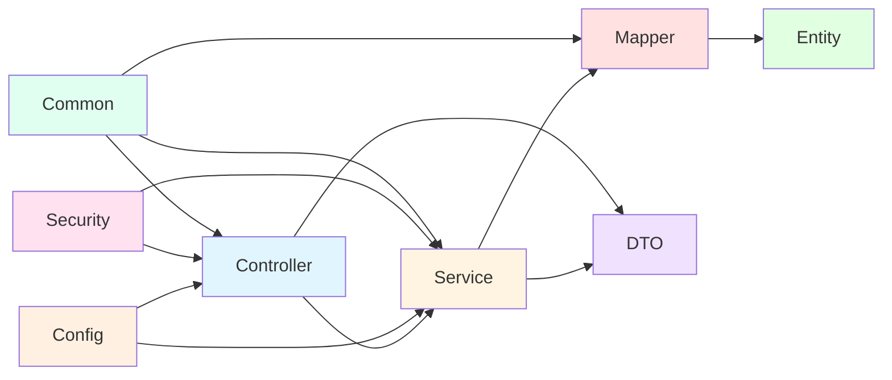
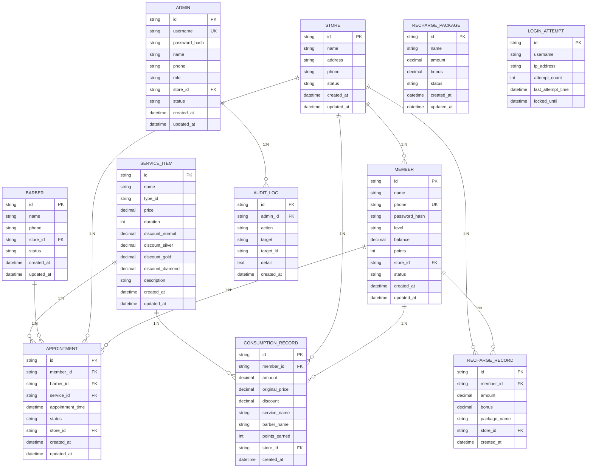
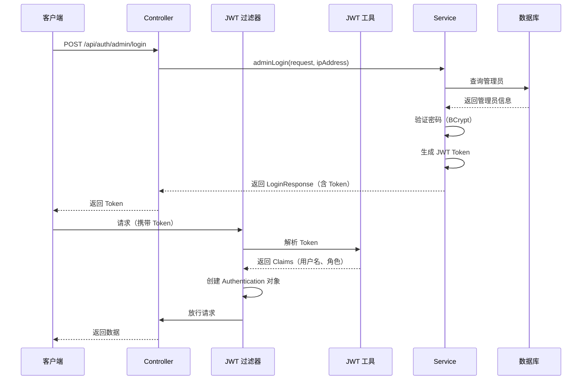
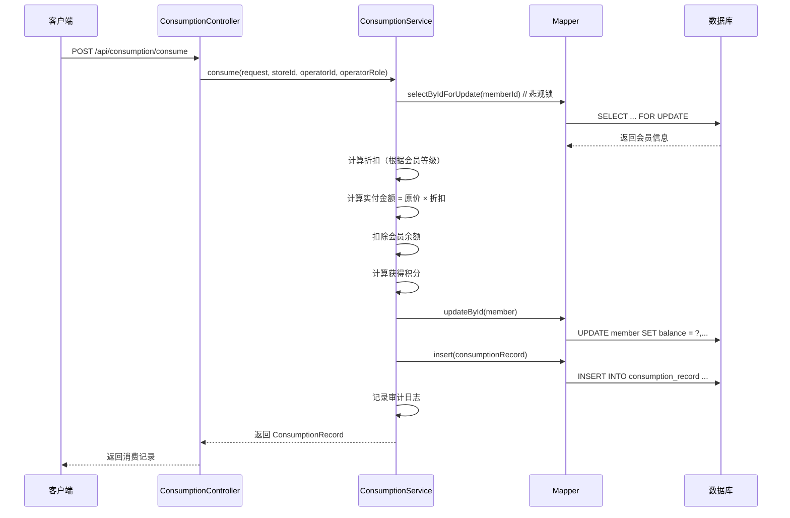
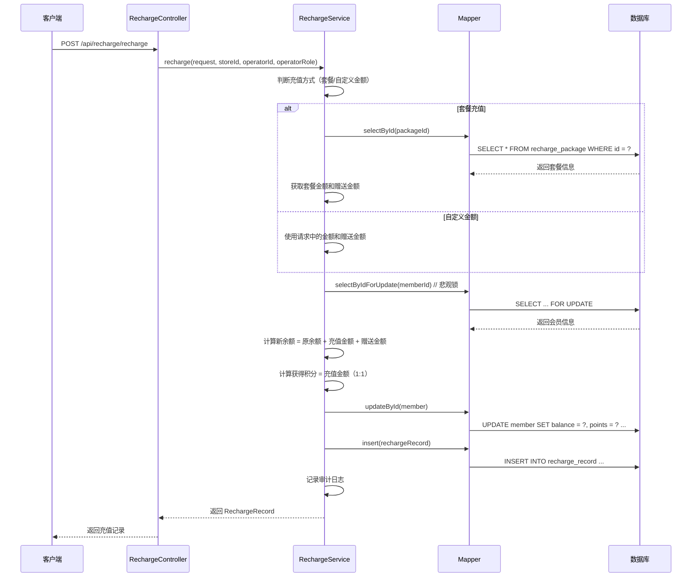
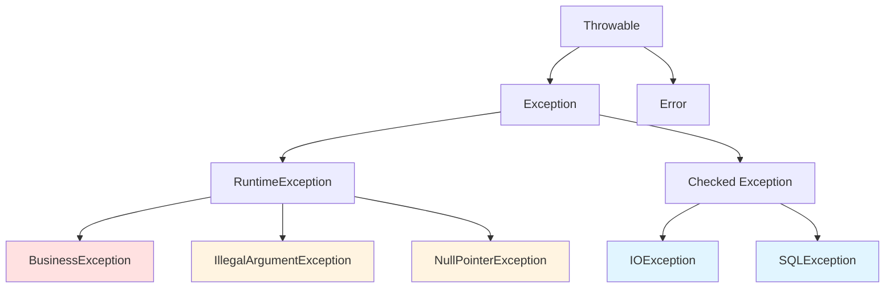
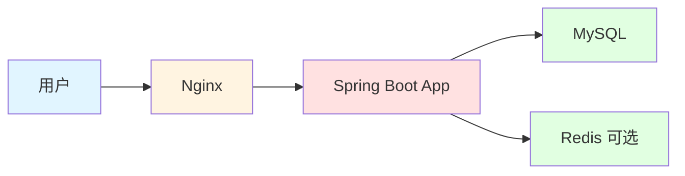
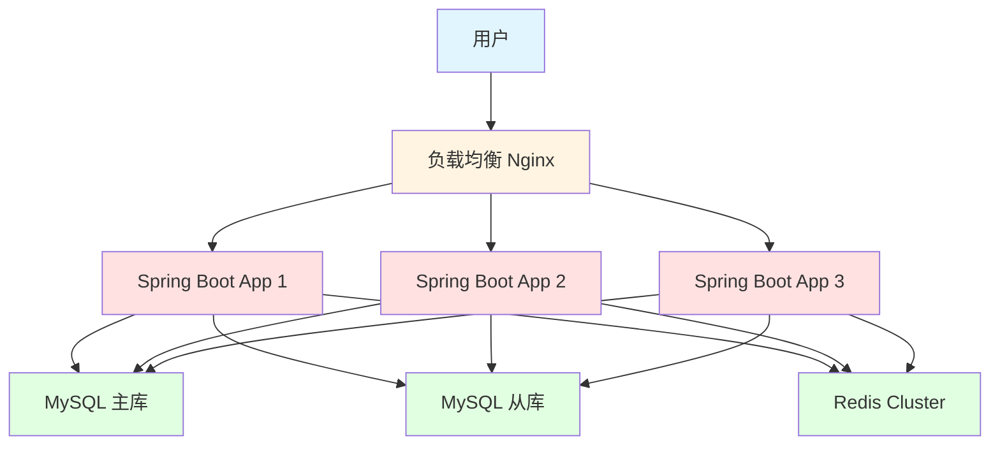

# MembershipSystem - 系统架构文档

> 本文档详细描述 MembershipSystem 会员管理系统的整体架构设计、模块划分、技术选型和数据安全机制。

---

## 📋 目录

- [系统架构 Overview](#系统架构-overview)
- [模块划分](#模块划分)
- [技术选型](#技术选型)
- [数据库设计](#数据库设计)
- [安全机制](#安全机制)
- [数据流设计](#数据流设计)
- [异常处理机制](#异常处理机制)
- [性能优化](#性能优化)

---

## 系统架构 Overview

### 整体架构图

```mermaid
graph TB
    subgraph "客户端层 Client Layer"
        A1[Web 浏览器]
        A2[移动端 App]
        A3[微信小程序]
    end
    
    subgraph "接入层 API Gateway"
        B1[Nginx 反向代理]
        B2[负载均衡 Load Balancer]
    end
    
    subgraph "应用层 Application Layer"
        C1[Controller 控制器]
        C2[Service 业务层]
        C3[Mapper 数据访问层]
    end
    
    subgraph "安全层 Security Layer"
        D1[JWT 认证过滤器]
        D2[Spring Security]
        D3[权限控制]
    end
    
    subgraph "数据层 Data Layer"
        E1[MySQL 数据库]
        E2[Redis 缓存<br/>可选]
    end
    
    subgraph "外部服务 External Services"
        F1[短信服务 SMS]
        F2[支付服务 Payment]
        F3[邮件服务 Email]
    end
    
    A1 --> B1
    A2 --> B1
    A3 --> B1
    B1 --> B2
    B2 --> C1
    C1 --> D1
    D1 --> D2
    D2 --> C2
    C2 --> C3
    C3 --> E1
    C2 --> F1
    C2 --> F2
    C2 --> F3
    C2 --> E2
    
    style A1 fill:#e1f5ff
    style A2 fill:#e1f5ff
    style A3 fill:#e1f5ff
    style C1 fill:#fff4e1
    style C2 fill:#fff4e1
    style C3 fill:#fff4e1
    style D1 fill:#ffe1e1
    style D2 fill:#ffe1e1
    style D3 fill:#ffe1e1
    style E1 fill:#e1ffe1
    style E2 fill:#e1ffe1
```



### 架构分层说明

| 层级 | 组件 | 职责 |
|------|------|------|
| **客户端层** | Web、移动端、小程序 | 提供用户界面和交互 |
| **接入层** | Nginx、负载均衡 | 请求转发、静态资源服务、SSL 终结 |
| **应用层** | Controller、Service、Mapper | 处理业务逻辑、数据访问 |
| **安全层** | JWT、Spring Security | 认证、授权、防护 |
| **数据层** | MySQL、Redis | 数据持久化、缓存 |

---

## 模块划分

### 项目包结构

```
com.membership/
├── controller/                            # 控制器层（Web 层）
│   ├── AuthController.java               # 认证接口
│   ├── MemberController.java             # 会员管理接口
│   ├── StoreController.java             # 门店管理接口
│   ├── BarberController.java            # 理发师管理接口
│   ├── ServiceController.java           # 服务项目管理接口
│   ├── AppointmentController.java        # 预约管理接口
│   ├── ConsumptionController.java        # 消费记录接口
│   ├── RechargeController.java          # 充值记录接口
│   ├── DashboardController.java         # 数据统计接口
│   └── AdminController.java             # 管理员管理接口
│
├── service/                              # 业务层接口
│   ├── AuthService.java
│   ├── MemberService.java
│   ├── StoreService.java
│   ├── BarberService.java
│   ├── ServiceItemService.java
│   ├── AppointmentService.java
│   ├── ConsumptionService.java
│   ├── RechargeService.java
│   ├── DashboardService.java
│   ├── AdminService.java
│   └── AuditLogService.java
│
├── service/impl/                         # 业务层实现
│   ├── AuthServiceImpl.java
│   ├── MemberServiceImpl.java
│   ├── StoreServiceImpl.java
│   ├── BarberServiceImpl.java
│   ├── ServiceItemServiceImpl.java
│   ├── AppointmentServiceImpl.java
│   ├── ConsumptionServiceImpl.java
│   ├── RechargeServiceImpl.java
│   ├── DashboardServiceImpl.java
│   ├── AdminServiceImpl.java
│   └── AuditLogServiceImpl.java
│
├── mapper/                               # 数据访问层接口
│   ├── MemberMapper.java
│   ├── StoreMapper.java
│   ├── BarberMapper.java
│   ├── ServiceItemMapper.java
│   ├── AppointmentMapper.java
│   ├── ConsumptionRecordMapper.java
│   ├── RechargeRecordMapper.java
│   ├── AdminMapper.java
│   ├── LoginAttemptMapper.java
│   └── AuditLogMapper.java
│
├── entity/                               # 实体类（ORM）
│   ├── Member.java
│   ├── Store.java
│   ├── Barber.java
│   ├── ServiceItem.java
│   ├── Appointment.java
│   ├── ConsumptionRecord.java
│   ├── RechargeRecord.java
│   ├── RechargePackage.java
│   ├── Admin.java
│   └── AuditLog.java
│
├── dto/                                  # 数据传输对象
│   ├── request/                          # 请求 DTO
│   │   ├── LoginRequest.java
│   │   ├── MemberLoginRequest.java
│   │   ├── ConsumeRequest.java
│   │   ├── RechargeRequest.java
│   │   └── AppointmentRequest.java
│   └── response/                         # 响应 DTO
│       ├── LoginResponse.java
│       ├── MemberLoginResponse.java
│       ├── MemberVO.java
│       ├── AppointmentVO.java
│       ├── ConsumptionRecordVO.java
│       └── RechargeRecordVO.java
│
├── enums/                                # 枚举类
│   ├── AdminRole.java
│   ├── AppointmentStatus.java
│   ├── MemberLevel.java
│   └── Status.java
│
├── config/                               # 配置类
│   ├── SecurityConfig.java              # Spring Security 配置
│   ├── MyBatisPlusConfig.java          # MyBatis-Plus 配置
│   └── OpenApiConfig.java             # Swagger/OpenAPI 配置
│
├── security/                              # 安全相关
│   ├── JwtUtil.java                    # JWT 工具类
│   ├── JwtAuthFilter.java              # JWT 认证过滤器
│   ├── UnauthorizedHandler.java        # 未授权处理
│   └── StoreAccessUtil.java            # 门店访问权限工具
│
├── common/                                # 公共类
│   ├── Result.java                      # 统一响应结果
│   ├── BusinessException.java           # 业务异常
│   └── GlobalExceptionHandler.java      # 全局异常处理
│
└── MembershipApplication.java             # 启动类
```

### 模块依赖关系



---

## 技术选型

### 后端技术栈

| 技术 | 版本 | 用途 | 选型理由 |
|------|------|------|---------|
| **Java** | 17 | 编程语言 | LTS 版本，性能优秀，新特性支持 |
| **Spring Boot** | 3.4.5 | 快速开发框架 | 社区活跃，生态完善，快速开发 |
| **MyBatis-Plus** | 3.5.12 | ORM 框架 | 简化 CRUD，支持分页、逻辑删除、乐观锁 |
| **MySQL** | 8.0+ | 关系型数据库 | 成熟稳定，性能优秀，支持 JSON |
| **Lombok** | 1.18.38 | 简化 Java 代码 | 减少样板代码，提高开发效率 |
| **JWT** | 0.11.5 | 认证授权 | 无状态认证，适合分布式系统 |
| **Spring Security** | 6.x | 安全框架 | 与 Spring Boot 集成良好，功能强大 |
| **SpringDoc OpenAPI** | 2.8.5 | API 文档生成 | 自动生成 Swagger UI，便于测试 |
| **HuTool** | 5.8.34 | Java 工具库 | 提供丰富的工具类，简化开发 |
| **BCrypt** | - | 密码加密 | 安全的密码哈希算法，自带盐值 |

### 前端技术栈（可选）

| 技术 | 版本 | 用途 |
|------|------|------|
| **HTML5 + CSS3 + JavaScript** | - | 原生前端技术 |
| **Thymeleaf** | 3.x | 模板引擎（可选） |
| **Vue.js / React** | - | 前端框架（可选） |

### 开发工具

| 工具 | 用途 |
|------|------|
| **Maven** | 项目构建工具 |
| **Git** | 版本控制 |
| **Postman** | API 测试工具 |
| **Swagger UI** | API 文档可视化 |
| **IntelliJ IDEA** | Java IDE（推荐） |
| **Navicat / MySQL Workbench** | 数据库管理工具 |

---

## 数据库设计

### 数据库表结构概览



### 表结构设计要点

#### 1. 会员表（member）

| 字段名 | 类型 | 约束 | 说明 |
|--------|------|------|------|
| id | VARCHAR(64) | PK | 雪花算法生成 |
| name | VARCHAR(100) | NOT NULL | 会员姓名 |
| phone | VARCHAR(20) | NOT NULL, UK | 手机号（唯一） |
| password_hash | VARCHAR(100) | NOT NULL | BCrypt 加密密码 |
| level | VARCHAR(20) | NOT NULL, DEFAULT 'normal' | 会员等级 |
| balance | DECIMAL(10,2) | NOT NULL, DEFAULT 0 | 账户余额 |
| points | INT | NOT NULL, DEFAULT 0 | 积分 |
| store_id | VARCHAR(64) | FK | 所属门店 |
| status | VARCHAR(20) | NOT NULL, DEFAULT 'active' | 状态 |
| created_at | DATETIME | NOT NULL | 创建时间 |
| updated_at | DATETIME | NOT NULL | 更新时间 |

**索引**：
- PRIMARY KEY (id)
- UNIQUE KEY uk_phone (phone)
- INDEX idx_store_id (store_id)
- INDEX idx_status (status)
- INDEX idx_created_at (created_at)

#### 2. 消费记录表（consumption_record）

| 字段名 | 类型 | 约束 | 说明 |
|--------|------|------|------|
| id | VARCHAR(64) | PK | 记录 ID |
| member_id | VARCHAR(64) | NOT NULL, FK | 会员 ID |
| amount | DECIMAL(10,2) | NOT NULL | 实付金额 |
| original_price | DECIMAL(10,2) | NOT NULL | 原价 |
| discount | DECIMAL(10,2) | NOT NULL | 折扣金额 |
| service_name | VARCHAR(200) | NOT NULL | 服务项目名称 |
| barber_name | VARCHAR(100) | | 理发师姓名 |
| points_earned | INT | NOT NULL | 获得积分 |
| store_id | VARCHAR(64) | NOT NULL, FK | 门店 ID |
| created_at | DATETIME | NOT NULL | 创建时间 |

**索引**：
- PRIMARY KEY (id)
- INDEX idx_member_id (member_id)
- INDEX idx_store_id (store_id)
- INDEX idx_created_at (created_at)

#### 3. 充值记录表（recharge_record）

| 字段名 | 类型 | 约束 | 说明 |
|--------|------|------|------|
| id | VARCHAR(64) | PK | 记录 ID |
| member_id | VARCHAR(64) | NOT NULL, FK | 会员 ID |
| amount | DECIMAL(10,2) | NOT NULL | 充值金额 |
| bonus | DECIMAL(10,2) | NOT NULL, DEFAULT 0 | 赠送金额 |
| package_name | VARCHAR(100) | | 套餐名称 |
| store_id | VARCHAR(64) | NOT NULL, FK | 门店 ID |
| created_at | DATETIME | NOT NULL | 创建时间 |

**索引**：
- PRIMARY KEY (id)
- INDEX idx_member_id (member_id)
- INDEX idx_store_id (store_id)
- INDEX idx_created_at (created_at)

---

## 安全机制

### 认证流程



### JWT Token 结构

```
Header.Payload.Signature

Header:
{
  "alg": "HS256",
  "typ": "JWT"
}

Payload:
{
  "sub": "admin",           // 用户名
  "roles": "ROLE_SUPER_ADMIN",  // 角色
  "storeId": null,         // 门店 ID（门店管理员有值）
  "iat": 1623000000,       // 签发时间
  "exp": 1623086400        // 过期时间（24 小时）
}

Signature:
HMACSHA256(
  base64UrlEncode(header) + "." +
  base64UrlEncode(payload),
  secret)
```

### 权限控制

#### 角色定义

| 角色 | 权限说明 |
|------|---------|
| **ROLE_SUPER_ADMIN** | 超级管理员，拥有所有权限 |
| **ROLE_STORE_ADMIN** | 门店管理员，仅限管理所属门店数据 |
| **ROLE_MEMBER** | 会员，仅限查看和修改自己的信息 |

#### 权限控制实现

1. **JWT 过滤器（JwtAuthFilter）**：
   - 从 HTTP Header 中提取 Token
   - 解析 Token，获取用户名和角色
   - 创建 `UsernamePasswordAuthenticationToken` 对象
   - 将认证信息存入 `SecurityContextHolder`

2. **方法级权限控制（@PreAuthorize）**：
   ```java
   @PreAuthorize("hasRole('SUPER_ADMIN')")
   public void deleteMember(String id) {
       // 只有超级管理员可以删除会员
   }
   ```

3. **门店数据隔离（StoreAccessUtil）**：
   ```java
   public void checkStoreAccess(String targetStoreId, Authentication auth) {
       if (auth == null) return;
       if (hasRoleSuperAdmin(auth)) return;  // 超级管理员可访问所有门店
       String myStoreId = (String) auth.getCredentials();
       if (!myStoreId.equals(targetStoreId)) {
           throw new BusinessException(403, "无权访问其他门店数据");
       }
   }
   ```

### 安全防护

| 安全措施 | 实现方式 |
|---------|---------|
| **密码加密** | BCrypt 算法，自带盐值，不可逆 |
| **登录失败锁定** | 同一个用户名 5 次失败后锁定 15 分钟 |
| **JWT 过期时间** | Token 有效期 24 小时 |
| **HTTPS** | 生产环境必须启用（在 Nginx 中配置） |
| **SQL 注入防护** | 使用 MyBatis-Plus，避免 SQL 拼接 |
| **XSS 防护** | 前端输入校验 + 后端输出转义 |
| **CSRF 防护** | 使用 JWT Token，无需 CSRF Token |

---

## 数据流设计

### 会员消费流程



### 会员充值流程



---

## 异常处理机制

### 异常分类



### 全局异常处理

#### 1. 业务异常（BusinessException）

```java
// 业务异常类
public class BusinessException extends RuntimeException {
    private final int code;
    
    public BusinessException(String message) {
        super(message);
        this.code = 400;
    }
    
    public BusinessException(int code, String message) {
        super(message);
        this.code = code;
    }
    
    public int getCode() {
        return code;
    }
}

// 抛出业务异常
public Member create(Member member) {
    Member existing = getByPhone(member.getPhone());
    if (existing != null) {
        throw new BusinessException("手机号已注册");
    }
    // ...
}
```

#### 2. 全局异常处理器（GlobalExceptionHandler）

```java
@RestControllerAdvice
public class GlobalExceptionHandler {
    
    // 处理业务异常
    @ExceptionHandler(BusinessException.class)
    public Result<Void> handleBusinessException(BusinessException e) {
        return Result.error(e.getCode(), e.getMessage());
    }
    
    // 处理参数校验异常
    @ExceptionHandler(MethodArgumentNotValidException.class)
    public Result<Void> handleValidationException(MethodArgumentNotValidException e) {
        String message = e.getBindingResult().getFieldError().getDefaultMessage();
        return Result.error(400, message);
    }
    
    // 处理其他异常
    @ExceptionHandler(Exception.class)
    public Result<Void> handleException(Exception e) {
        log.error("系统异常", e);
        return Result.error(500, "系统异常，请联系管理员");
    }
}
```

#### 3. 统一响应格式（Result）

```java
@Data
public class Result<T> {
    private int code;
    private String message;
    private T data;
    private long timestamp;
    
    public static <T> Result<T> success(T data) {
        Result<T> result = new Result<>();
        result.setCode(200);
        result.setMessage("操作成功");
        result.setData(data);
        result.setTimestamp(System.currentTimeMillis());
        return result;
    }
    
    public static <T> Result<T> error(int code, String message) {
        Result<T> result = new Result<>();
        result.setCode(code);
        result.setMessage(message);
        result.setTimestamp(System.currentTimeMillis());
        return result;
    }
}
```

### 错误码定义

| 错误码 | 说明 |
|--------|------|
| **200** | 成功 |
| **400** | 参数错误 / 业务错误 |
| **401** | 未认证（Token 缺失或无效） |
| **403** | 无权限 |
| **404** | 资源不存在 |
| **409** | 资源冲突（如手机号已注册） |
| **429** | 请求过于频繁（登录失败锁定） |
| **500** | 系统异常 |

---

## 性能优化

### 数据库优化

#### 1. 索引优化

```sql
-- 会员表索引
CREATE INDEX idx_member_phone ON member(phone);
CREATE INDEX idx_member_store_id ON member(store_id);
CREATE INDEX idx_member_status ON member(status);
CREATE INDEX idx_member_created_at ON member(created_at DESC);

-- 消费记录表索引
CREATE INDEX idx_consumption_member_id ON consumption_record(member_id);
CREATE INDEX idx_consumption_store_id ON consumption_record(store_id);
CREATE INDEX idx_consumption_created_at ON consumption_record(created_at DESC);

-- 充值记录表索引
CREATE INDEX idx_recharge_member_id ON recharge_record(member_id);
CREATE INDEX idx_recharge_store_id ON recharge_record(store_id);
CREATE INDEX idx_recharge_created_at ON recharge_record(created_at DESC);
```

#### 2. 分页查询优化

```java
// 使用 MyBatis-Plus 分页插件
@Configuration
public class MyBatisPlusConfig {
    @Bean
    public MybatisPlusInterceptor mybatisPlusInterceptor() {
        MybatisPlusInterceptor interceptor = new MybatisPlusInterceptor();
        interceptor.addInnerInterceptor(new PaginationInnerInterceptor(DbType.MYSQL));
        return interceptor;
    }
}

// 分页查询
public IPage<Member> page(int pageNum, int pageSize, String keyword, String storeId) {
    Page<Member> page = new Page<>(pageNum, pageSize);
    LambdaQueryWrapper<Member> wrapper = new LambdaQueryWrapper<>();
    if (keyword != null && !keyword.isEmpty()) {
        wrapper.like(Member::getName, keyword).or().like(Member::getPhone, keyword);
    }
    if (storeId != null && !storeId.isEmpty()) {
        wrapper.eq(Member::getStoreId, storeId);
    }
    wrapper.orderByDesc(Member::getCreatedAt);
    return baseMapper.selectPage(page, wrapper);
}
```

#### 3. 悲观锁优化

```java
// Mapper 接口
@Select("SELECT * FROM member WHERE id = #{id} FOR UPDATE")
Member selectByIdForUpdate(String id);

// Service 实现
public void consume(ConsumeRequest request, ...) {
    // 使用悲观锁，防止并发问题
    Member member = memberMapper.selectByIdForUpdate(request.getMemberId());
    // ... 扣款操作
}
```

### 缓存优化（可选）

#### 1. 使用 Redis 缓存

```xml
<!-- pom.xml -->
<dependency>
    <groupId>org.springframework.boot</groupId>
    <artifactId>spring-boot-starter-data-redis</artifactId>
</dependency>
```

```java
// 配置 Redis 缓存
@Configuration
public class RedisConfig {
    @Bean
    public RedisTemplate<String, Object> redisTemplate(RedisConnectionFactory factory) {
        RedisTemplate<String, Object> template = new RedisTemplate<>();
        template.setConnectionFactory(factory);
        template.setKeySerializer(new StringRedisSerializer());
        template.setValueSerializer(new GenericJackson2JsonRedisSerializer());
        return template;
    }
}

// 使用缓存
@Service
public class MemberServiceImpl implements MemberService {
    @Autowired
    private RedisTemplate<String, Object> redisTemplate;
    
    @Override
    @Cacheable(value = "member", key = "#id")
    public Member getById(String id) {
        return baseMapper.selectById(id);
    }
    
    @Override
    @CacheEvict(value = "member", key = "#id")
    public Member update(String id, Member member) {
        // ... 更新操作
    }
}
```

### 查询优化

#### 1. 避免 N+1 查询问题

```java
// 错误示例：N+1 查询
public List<ConsumptionRecordVO> getRecords() {
    List<ConsumptionRecord> records = consumptionRecordMapper.selectList(null);
    List<ConsumptionRecordVO> vos = new ArrayList<>();
    for (ConsumptionRecord record : records) {
        Member member = memberMapper.selectById(record.getMemberId());  // N 次查询
        ConsumptionRecordVO vo = new ConsumptionRecordVO();
        BeanUtils.copyProperties(record, vo);
        vo.setMemberName(member.getName());
        vos.add(vo);
    }
    return vos;
}

// 正确示例：批量查询
public List<ConsumptionRecordVO> getRecords() {
    List<ConsumptionRecord> records = consumptionRecordMapper.selectList(null);
    List<ConsumptionRecordVO> vos = records.stream()
            .map(ConsumptionRecordVO::fromEntity)
            .collect(Collectors.toList());
    
    // 批量查询会员信息
    Set<String> memberIds = vos.stream()
            .map(ConsumptionRecordVO::getMemberId)
            .collect(Collectors.toSet());
    List<Member> members = memberMapper.selectBatchIds(memberIds);
    Map<String, Member> memberMap = members.stream()
            .collect(Collectors.toMap(Member::getId, m -> m));
    
    // 填充会员信息
    vos.forEach(vo -> {
        Member member = memberMap.get(vo.getMemberId());
        if (member != null) {
            vo.setMemberName(member.getName());
            vo.setMemberPhone(member.getPhone());
        }
    });
    
    return vos;
}
```

---

## 部署架构

### 单机部署架构



### 集群部署架构



---

## 监控和日志

### 日志配置

```yaml
# application.yml
logging:
  level:
    com.membership: DEBUG
    com.membership.mapper: TRACE  # 打印 SQL 语句
    org.springframework.security: DEBUG
  pattern:
    console: "%d{yyyy-MM-dd HH:mm:ss} [%thread] %-5level %logger{36} - %msg%n"
  file:
    name: logs/membership.log
    max-size: 10MB
    max-history: 30
```

### 审计日志

```java
// 审计日志实体
@Entity
@Table(name = "audit_log")
public class AuditLog {
    @Id
    private String id;
    private String adminId;       // 操作人 ID
    private String action;        // 操作类型（如 RECHARGE, CONSUME）
    private String target;        // 操作对象（如 member, store）
    private String targetId;      // 操作对象 ID
    private String detail;        // 操作详情
    private LocalDateTime createdAt;
}

// 记录审计日志
@Service
public class AuditLogServiceImpl implements AuditLogService {
    @Override
    public void log(String adminId, String role, String action, String target, String targetId, String detail, String storeId) {
        AuditLog log = new AuditLog();
        log.setId(IdGenerator.nextId());
        log.setAdminId(adminId);
        log.setAction(action);
        log.setTarget(target);
        log.setTargetId(targetId);
        log.setDetail(detail);
        log.setStoreId(storeId);
        log.setCreatedAt(LocalDateTime.now());
        auditLogMapper.insert(log);
    }
}
```

---

## 总结

本架构文档详细描述了 MembershipSystem 会员管理系统的：

1. **系统架构**：分层架构 + 安全层设计
2. **模块划分**：Controller → Service → Mapper → Entity 四层架构
3. **技术选型**：Spring Boot + MyBatis-Plus + JWT + Spring Security
4. **数据库设计**：9 张核心业务表，支持多门店、多角色
5. **安全机制**：JWT 认证 + BCrypt 加密 + 登录失败锁定 + 门店数据隔离
6. **数据流设计**：会员消费和充值完整流程图
7. **异常处理**：业务异常 + 全局异常处理器 + 统一响应格式
8. **性能优化**：索引优化 + 分页查询 + 悲观锁 + 缓存策略

---

**文档版本**：v1.0  
**作者**：黄志鹏  
**日期**：2026-06-09  
**联系**：your-email@example.com
