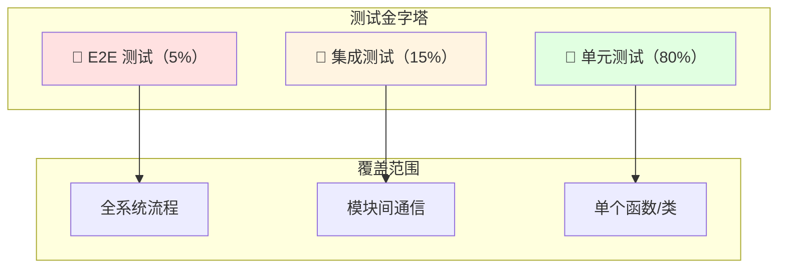

# MembershipSystem - 测试文档

> 会员管理系统测试用例与 API 测试脚本

---

## 📋 目录

- [测试策略](#测试策略)
- [单元测试](#单元测试)
- [API 测试](#api-测试)
- [Postman 测试集合](#postman-测试集合)
- [性能测试](#性能测试)
- [测试数据准备](#测试数据准备)
- [测试检查清单](#测试检查清单)

---

## 测试策略

### 测试金字塔



| 层级 | 占比 | 目标 | 工具 |
|------|------|------|------|
| **单元测试** | 80% | Service 层、工具类 | JUnit 5 + Mockito |
| **集成测试** | 15% | Controller + Mapper | Spring Boot Test + H2 |
| **E2E 测试** | 5% | 完整业务流程 | Postman / REST Assured |

### 测试覆盖要求

| 层级 | 覆盖率要求 | 必测内容 |
|------|-----------|---------|
| **Service** | ≥ 90% | 所有业务逻辑分支 |
| **Controller** | ≥ 80% | 所有 API 端点 |
| **Mapper** | ≥ 70% | 自定义 SQL 方法 |
| **Utils** | ≥ 95% | 工具类方法 |

---

## 单元测试

### 1. JUnit 5 + Mockito 依赖

```xml
<!-- pom.xml -->
<dependencies>
    <!-- JUnit 5 -->
    <dependency>
        <groupId>org.junit.jupiter</groupId>
        <artifactId>junit-jupiter</artifactId>
        <scope>test</scope>
    </dependency>

    <!-- Mockito -->
    <dependency>
        <groupId>org.mockito</groupId>
        <artifactId>mockito-core</artifactId>
        <scope>test</scope>
    </dependency>

    <!-- Spring Boot Test -->
    <dependency>
        <groupId>org.springframework.boot</groupId>
        <artifactId>spring-boot-starter-test</artifactId>
        <scope>test</scope>
    </dependency>

    <!-- H2 内存数据库（集成测试用） -->
    <dependency>
        <groupId>com.h2database</groupId>
        <artifactId>h2</artifactId>
        <scope>test</scope>
    </dependency>
</dependencies>
```

### 2. AuthService 单元测试

```java
package com.membership.service.impl;

import com.membership.dto.request.LoginRequest;
import com.membership.dto.response.LoginResponse;
import com.membership.entity.Admin;
import com.membership.enums.AdminRole;
import com.membership.exception.BusinessException;
import com.membership.mapper.AdminMapper;
import com.membership.mapper.LoginAttemptMapper;
import com.membership.security.JwtUtil;
import org.junit.jupiter.api.BeforeEach;
import org.junit.jupiter.api.DisplayName;
import org.junit.jupiter.api.Nested;
import org.junit.jupiter.api.Test;
import org.junit.jupiter.api.extension.ExtendWith;
import org.mockito.InjectMocks;
import org.mockito.Mock;
import org.mockito.junit.jupiter.MockitoExtension;
import org.springframework.security.crypto.bcrypt.BCryptPasswordEncoder;

import static org.junit.jupiter.api.Assertions.*;
import static org.mockito.ArgumentMatchers.*;
import static org.mockito.Mockito.*;

@ExtendWith(MockitoExtension.class)
class AuthServiceImplTest {

    @Mock
    private AdminMapper adminMapper;

    @Mock
    private LoginAttemptMapper loginAttemptMapper;

    @Mock
    private JwtUtil jwtUtil;

    @InjectMocks
    private AuthServiceImpl authService;

    private BCryptPasswordEncoder passwordEncoder;
    private LoginRequest validRequest;
    private Admin testAdmin;

    @BeforeEach
    void setUp() {
        passwordEncoder = new BCryptPasswordEncoder();

        validRequest = new LoginRequest();
        validRequest.setUsername("admin");
        validRequest.setPassword("admin123");

        testAdmin = new Admin();
        testAdmin.setId("admin001");
        testAdmin.setUsername("admin");
        testAdmin.setPasswordHash(passwordEncoder.encode("admin123"));
        testAdmin.setRole(AdminRole.SUPER_ADMIN.name());
        testAdmin.setName("超级管理员");
        testAdmin.setStoreId(null);
        testAdmin.setStatus("active");
    }

    @Nested
    @DisplayName("管理员登录测试")
    class AdminLoginTests {

        @Test
        @DisplayName("登录成功 - 返回 Token")
        void loginSuccess_ShouldReturnToken() {
            // Arrange
            when(adminMapper.findByUsername("admin")).thenReturn(testAdmin);
            when(loginAttemptMapper.countRecentAttempts(eq("admin"), any())).thenReturn(0);
            when(jwtUtil.generateToken(eq("admin"), eq("ROLE_SUPER_ADMIN"), isNull()))
                    .thenReturn("mock-jwt-token");

            // Act
            LoginResponse response = authService.adminLogin(validRequest, "127.0.0.1");

            // Assert
            assertNotNull(response);
            assertEquals("mock-jwt-token", response.getToken());
            assertEquals("admin", response.getAdmin().getUsername());
            assertEquals(AdminRole.SUPER_ADMIN.name(), response.getAdmin().getRole());

            verify(adminMapper).findByUsername("admin");
            verify(jwtUtil).generateToken(eq("admin"), eq("ROLE_SUPER_ADMIN"), isNull());
        }

        @Test
        @DisplayName("登录失败 - 用户不存在")
        void loginFail_UserNotFound_ShouldThrowException() {
            // Arrange
            when(adminMapper.findByUsername("nonexistent")).thenReturn(null);
            LoginRequest request = new LoginRequest();
            request.setUsername("nonexistent");
            request.setPassword("anypass");

            // Act & Assert
            BusinessException exception = assertThrows(BusinessException.class,
                    () -> authService.adminLogin(request, "127.0.0.1"));
            assertEquals("用户名或密码错误", exception.getMessage());
        }

        @Test
        @DisplayName("登录失败 - 密码错误")
        void loginFail_WrongPassword_ShouldThrowException() {
            // Arrange
            when(adminMapper.findByUsername("admin")).thenReturn(testAdmin);
            when(loginAttemptMapper.countRecentAttempts(eq("admin"), any())).thenReturn(0);
            LoginRequest request = new LoginRequest();
            request.setUsername("admin");
            request.setPassword("wrongpassword");

            // Act & Assert
            BusinessException exception = assertThrows(BusinessException.class,
                    () -> authService.adminLogin(request, "127.0.0.1"));
            assertEquals("用户名或密码错误", exception.getMessage());

            // 验证登录失败次数增加
            verify(loginAttemptMapper, times(1)).recordAttempt(any());
        }

        @Test
        @DisplayName("登录失败 - 用户被锁定（5次失败）")
        void loginFail_AccountLocked_ShouldThrowException() {
            // Arrange
            when(loginAttemptMapper.countRecentAttempts(eq("admin"), any())).thenReturn(5);

            // Act & Assert
            BusinessException exception = assertThrows(BusinessException.class,
                    () -> authService.adminLogin(validRequest, "127.0.0.1"));
            assertEquals("账户已被锁定，请15分钟后重试", exception.getMessage());

            // 验证没有查询数据库或生成 Token
            verify(adminMapper, never()).findByUsername(any());
            verify(jwtUtil, never()).generateToken(any(), any(), any());
        }

        @Test
        @DisplayName("登录失败 - 用户状态为停用")
        void loginFail_UserDisabled_ShouldThrowException() {
            // Arrange
            testAdmin.setStatus("inactive");
            when(adminMapper.findByUsername("admin")).thenReturn(testAdmin);
            when(loginAttemptMapper.countRecentAttempts(eq("admin"), any())).thenReturn(0);

            // Act & Assert
            BusinessException exception = assertThrows(BusinessException.class,
                    () -> authService.adminLogin(validRequest, "127.0.0.1"));
            assertEquals("账户已被停用", exception.getMessage());
        }
    }
}
```

### 3. MemberService 单元测试

```java
package com.membership.service.impl;

import com.membership.entity.Member;
import com.membership.enums.MemberLevel;
import com.membership.exception.BusinessException;
import com.membership.mapper.MemberMapper;
import org.junit.jupiter.api.BeforeEach;
import org.junit.jupiter.api.DisplayName;
import org.junit.jupiter.api.Nested;
import org.junit.jupiter.api.Test;
import org.junit.jupiter.api.extension.ExtendWith;
import org.mockito.InjectMocks;
import org.mockito.Mock;
import org.mockito.junit.jupiter.MockitoExtension;

import java.math.BigDecimal;
import java.time.LocalDateTime;

import static org.junit.jupiter.api.Assertions.*;
import static org.mockito.ArgumentMatchers.*;
import static org.mockito.Mockito.*;

@ExtendWith(MockitoExtension.class)
class MemberServiceImplTest {

    @Mock
    private MemberMapper memberMapper;

    @InjectMocks
    private MemberServiceImpl memberService;

    private Member testMember;

    @BeforeEach
    void setUp() {
        testMember = new Member();
        testMember.setId("member001");
        testMember.setName("张三");
        testMember.setPhone("13800138000");
        testMember.setPasswordHash("hashed_password");
        testMember.setLevel(MemberLevel.NORMAL.name());
        testMember.setBalance(new BigDecimal("100.00"));
        testMember.setPoints(0);
        testMember.setStoreId("store001");
        testMember.setStatus("active");
        testMember.setCreatedAt(LocalDateTime.now());
    }

    @Nested
    @DisplayName("创建会员测试")
    class CreateMemberTests {

        @Test
        @DisplayName("创建成功 - 有效数据")
        void createSuccess_ShouldReturnMember() {
            // Arrange
            when(memberMapper.selectByPhone("13800138000")).thenReturn(null);
            when(memberMapper.insert(any(Member.class))).thenReturn(1);

            // Act
            Member result = memberService.create(testMember);

            // Assert
            assertNotNull(result);
            assertEquals("张三", result.getName());
            assertEquals("13800138000", result.getPhone());
            assertEquals(MemberLevel.NORMAL.name(), result.getLevel());
            assertEquals(0, result.getBalance().compareTo(BigDecimal.ZERO));

            verify(memberMapper).selectByPhone("13800138000");
            verify(memberMapper).insert(any(Member.class));
        }

        @Test
        @DisplayName("创建失败 - 手机号已存在")
        void createFail_PhoneExists_ShouldThrowException() {
            // Arrange
            when(memberMapper.selectByPhone("13800138000")).thenReturn(testMember);

            // Act & Assert
            BusinessException exception = assertThrows(BusinessException.class,
                    () -> memberService.create(testMember));
            assertEquals("手机号已注册", exception.getMessage());

            verify(memberMapper, never()).insert(any());
        }

        @Test
        @DisplayName("创建失败 - 手机号为空")
        void createFail_PhoneEmpty_ShouldThrowException() {
            // Arrange
            testMember.setPhone(null);

            // Act & Assert
            assertThrows(BusinessException.class,
                    () -> memberService.create(testMember));
            verify(memberMapper, never()).insert(any());
        }
    }

    @Nested
    @DisplayName("更新会员测试")
    class UpdateMemberTests {

        @Test
        @DisplayName("更新成功 - 修改姓名和等级")
        void updateSuccess_ShouldReturnUpdatedMember() {
            // Arrange
            when(memberMapper.selectById("member001")).thenReturn(testMember);
            when(memberMapper.updateById(any())).thenReturn(1);

            Member updateData = new Member();
            updateData.setName("张三（改名后）");
            updateData.setLevel(MemberLevel.GOLD.name());

            // Act
            Member result = memberService.update("member001", updateData);

            // Assert
            assertNotNull(result);
            assertEquals("张三（改名后）", result.getName());
            assertEquals(MemberLevel.GOLD.name(), result.getLevel());

            verify(memberMapper).selectById("member001");
            verify(memberMapper).updateById(any());
        }

        @Test
        @DisplayName("更新失败 - 会员不存在")
        void updateFail_NotFound_ShouldThrowException() {
            // Arrange
            when(memberMapper.selectById("nonexistent")).thenReturn(null);

            // Act & Assert
            BusinessException exception = assertThrows(BusinessException.class,
                    () -> memberService.update("nonexistent", new Member()));
            assertEquals("会员不存在", exception.getMessage());
        }

        @Test
        @DisplayName("更新失败 - 不允许修改密码")
        void updateFail_CannotChangePassword_ShouldThrowException() {
            // Arrange
            when(memberMapper.selectById("member001")).thenReturn(testMember);

            Member updateData = new Member();
            updateData.setPasswordHash("new_password");

            // Act & Assert
            BusinessException exception = assertThrows(BusinessException.class,
                    () -> memberService.update("member001", updateData));
            assertEquals("不允许修改密码", exception.getMessage());
        }

        @Test
        @DisplayName("更新失败 - 不允许修改手机号")
        void updateFail_CannotChangePhone_ShouldThrowException() {
            // Arrange
            when(memberMapper.selectById("member001")).thenReturn(testMember);

            Member updateData = new Member();
            updateData.setPhone("13900139000");

            // Act & Assert
            BusinessException exception = assertThrows(BusinessException.class,
                    () -> memberService.update("member001", updateData));
            assertEquals("不允许修改手机号", exception.getMessage());
        }
    }

    @Nested
    @DisplayName("删除会员测试")
    class DeleteMemberTests {

        @Test
        @DisplayName("删除成功 - 软删除/标记停用")
        void deleteSuccess_ShouldMarkInactive() {
            // Arrange
            when(memberMapper.selectById("member001")).thenReturn(testMember);

            // Act
            memberService.delete("member001");

            // Assert
            assertEquals("inactive", testMember.getStatus());
            verify(memberMapper).updateById(testMember);
        }

        @Test
        @DisplayName("删除失败 - 会员不存在")
        void deleteFail_NotFound_ShouldThrowException() {
            // Arrange
            when(memberMapper.selectById("nonexistent")).thenReturn(null);

            // Act & Assert
            assertThrows(BusinessException.class,
                    () -> memberService.delete("nonexistent"));
        }
    }
}
```

### 4. ConsumptionService 单元测试

```java
@Nested
@DisplayName("消费扣款测试")
class ConsumeTests {

    @Test
    @DisplayName("普通会员消费 - 无折扣")
    void consume_NormalMember_NoDiscount() {
        // Arrange: 普通会员消费原价 100 元的服务
        Member member = createTestMember(MemberLevel.NORMAL, new BigDecimal("500.00"));
        ServiceItem service = createTestService(new BigDecimal("100.00"));
        
        when(memberMapper.selectByIdForUpdate("member001")).thenReturn(member);
        when(serviceItemMapper.selectById("svc001")).thenReturn(service);
        when(memberMapper.updateById(any())).thenReturn(1);
        when(consumptionRecordMapper.insert(any())).thenReturn(1);

        ConsumeRequest request = new ConsumeRequest();
        request.setMemberId("member001");
        request.setServiceId("svc001");

        // Act
        ConsumptionRecord result = consumptionService.consume(request, "store001", "admin001", "store_admin");

        // Assert
        assertEquals(0, new BigDecimal("100.00").compareTo(result.getAmount()));  // 实付 100
        assertEquals(0, BigDecimal.ZERO.compareTo(result.getDiscount()));          // 折扣 0
        verify(memberMapper).selectByIdForUpdate("member001");  // 验证悲观锁
    }

    @Test
    @DisplayName("钻石会员消费 - 享受 7 折")
    void consume_DiamondMember_30PercentDiscount() {
        // Arrange: 钻石会员消费原价 100 元的服务
        Member member = createTestMember(MemberLevel.DIAMOND, new BigDecimal("500.00"));
        ServiceItem service = createTestService(new BigDecimal("100.00"));
        
        member.setLevel(MemberLevel.DIAMOND.name());

        when(memberMapper.selectByIdForUpdate("member001")).thenReturn(member);
        when(serviceItemMapper.selectById("svc001")).thenReturn(service);
        when(memberMapper.updateById(any())).thenReturn(1);
        when(consumptionRecordMapper.insert(any())).thenReturn(1);

        ConsumeRequest request = new ConsumeRequest();
        request.setMemberId("member001");
        request.setServiceId("svc001");

        // Act
        ConsumptionRecord result = consumptionService.consume(request, "store001", "admin001", "store_admin");

        // Assert
        assertEquals(0, new BigDecimal("70.00").compareTo(result.getAmount()));     // 实付 70
        assertEquals(0, new BigDecimal("30.00").compareTo(result.getDiscount()));   // 折扣 30
    }

    @Test
    @DisplayName("消费失败 - 余额不足")
    void consumeFail_InsufficientBalance_ShouldThrowException() {
        // Arrange
        Member member = createTestMember(MemberLevel.NORMAL, new BigDecimal("50.00"));
        ServiceItem service = createTestService(new BigDecimal("100.00"));

        when(memberMapper.selectByIdForUpdate("member001")).thenReturn(member);
        when(serviceItemMapper.selectById("svc001")).thenReturn(service);

        ConsumeRequest request = new ConsumeRequest();
        request.setMemberId("member001");
        request.setServiceId("svc001");

        // Act & Assert
        BusinessException exception = assertThrows(BusinessException.class,
                () -> consumptionService.consume(request, "store001", "admin001", "store_admin"));
        assertEquals("余额不足", exception.getMessage());
    }
}
```

---

## API 测试

### 1. API 测试结构

```java
package com.membership.controller;

import com.fasterxml.jackson.databind.ObjectMapper;
import com.membership.dto.request.LoginRequest;
import com.membership.dto.request.MemberLoginRequest;
import com.membership.entity.Admin;
import com.membership.security.JwtUtil;
import org.junit.jupiter.api.BeforeEach;
import org.junit.jupiter.api.DisplayName;
import org.junit.jupiter.api.Test;
import org.springframework.beans.factory.annotation.Autowired;
import org.springframework.boot.test.autoconfigure.web.servlet.AutoConfigureMockMvc;
import org.springframework.boot.test.context.SpringBootTest;
import org.springframework.http.MediaType;
import org.springframework.test.web.servlet.MockMvc;

import static org.springframework.test.web.servlet.request.MockMvcRequestBuilders.*;
import static org.springframework.test.web.servlet.result.MockMvcResultMatchers.*;

@SpringBootTest
@AutoConfigureMockMvc
class AuthControllerTest {

    @Autowired
    private MockMvc mockMvc;

    @Autowired
    private ObjectMapper objectMapper;

    @Autowired
    private JwtUtil jwtUtil;

    private String adminToken;
    private String memberToken;

    @BeforeEach
    void setUp() {
        adminToken = jwtUtil.generateToken("admin", "ROLE_SUPER_ADMIN", null);
        memberToken = jwtUtil.generateToken("13800138000", "ROLE_MEMBER", "store001");
    }

    @Test
    @DisplayName("POST /api/auth/admin/login - 管理员登录成功")
    void adminLogin_ShouldReturn200() throws Exception {
        LoginRequest request = new LoginRequest();
        request.setUsername("admin");
        request.setPassword("admin123");

        mockMvc.perform(post("/api/auth/admin/login")
                .contentType(MediaType.APPLICATION_JSON)
                .content(objectMapper.writeValueAsString(request)))
                .andExpect(status().isOk())
                .andExpect(jsonPath("$.code").value(200))
                .andExpect(jsonPath("$.data.token").isString())
                .andExpect(jsonPath("$.data.admin.username").value("admin"));
    }

    @Test
    @DisplayName("POST /api/auth/admin/login - 密码错误返回 400")
    void adminLogin_WrongPassword_ShouldReturn400() throws Exception {
        LoginRequest request = new LoginRequest();
        request.setUsername("admin");
        request.setPassword("wrongpassword");

        mockMvc.perform(post("/api/auth/admin/login")
                .contentType(MediaType.APPLICATION_JSON)
                .content(objectMapper.writeValueAsString(request)))
                .andExpect(status().isOk())
                .andExpect(jsonPath("$.code").value(400))
                .andExpect(jsonPath("$.message").value("用户名或密码错误"));
    }

    @Test
    @DisplayName("GET /api/members - 查询会员列表（需要管理员权限）")
    void listMembers_WithAdminToken_ShouldReturn200() throws Exception {
        mockMvc.perform(get("/api/members")
                .header("Authorization", "Bearer " + adminToken)
                .param("page", "1")
                .param("size", "10"))
                .andExpect(status().isOk())
                .andExpect(jsonPath("$.code").value(200))
                .andExpect(jsonPath("$.data.records").isArray())
                .andExpect(jsonPath("$.data.total").isNumber());
    }

    @Test
    @DisplayName("GET /api/members - 无 Token 返回 401")
    void listMembers_WithoutToken_ShouldReturn401() throws Exception {
        mockMvc.perform(get("/api/members"))
                .andExpect(status().isUnauthorized());
    }

    @Test
    @DisplayName("POST /api/members - 创建会员")
    void createMember_ShouldReturn201() throws Exception {
        String requestBody = """
            {
                "name": "测试会员",
                "phone": "13900139001",
                "passwordHash": "password123",
                "storeId": "store001"
            }
            """;

        mockMvc.perform(post("/api/members")
                .header("Authorization", "Bearer " + adminToken)
                .contentType(MediaType.APPLICATION_JSON)
                .content(requestBody))
                .andExpect(status().isOk())
                .andExpect(jsonPath("$.code").value(200))
                .andExpect(jsonPath("$.data.name").value("测试会员"));
    }
}
```

### 2. 集成测试数据准备

```java
package com.membership.config;

import org.springframework.boot.test.context.TestConfiguration;
import org.springframework.context.annotation.Bean;
import org.springframework.jdbc.datasource.embedded.EmbeddedDatabaseBuilder;
import org.springframework.jdbc.datasource.embedded.EmbeddedDatabaseType;
import javax.sql.DataSource;

@TestConfiguration
public class TestDatabaseConfig {

    @Bean
    public DataSource dataSource() {
        return new EmbeddedDatabaseBuilder()
                .setType(EmbeddedDatabaseType.H2)
                .addScript("classpath:test-schema.sql")
                .addScript("classpath:test-data.sql")
                .build();
    }
}
```

---

## Postman 测试集合

### 1. 环境变量配置

```json
{
  "name": "MembershipSystem [Test]",
  "values": [
    {
      "key": "base_url",
      "value": "http://localhost:8080",
      "type": "default"
    },
    {
      "key": "admin_token",
      "value": "",
      "type": "default"
    },
    {
      "key": "member_token",
      "value": "",
      "type": "default"
    },
    {
      "key": "admin_username",
      "value": "admin",
      "type": "default"
    },
    {
      "key": "admin_password",
      "value": "admin123",
      "type": "secret"
    },
    {
      "key": "member_phone",
      "value": "13800138000",
      "type": "default"
    },
    {
      "key": "member_password",
      "value": "password123",
      "type": "secret"
    }
  ]
}
```

### 2. 测试集合 JSON（可导入 Postman）

```json
{
  "info": {
    "name": "MembershipSystem API Tests",
    "schema": "https://schema.getpostman.com/json/collection/v2.1.0/collection.json"
  },
  "item": [
    {
      "name": "01 - 认证",
      "item": [
        {
          "name": "管理员登录",
          "event": [
            {
              "listen": "test",
              "script": {
                "exec": [
                  "pm.test('Status code is 200', () => {",
                  "    pm.response.to.have.status(200);",
                  "});",
                  "",
                  "pm.test('Response has token', () => {",
                  "    const jsonData = pm.response.json();",
                  "    pm.expect(jsonData.code).to.eql(200);",
                  "    pm.expect(jsonData.data.token).to.not.be.empty;",
                  "    pm.collectionVariables.set('admin_token', jsonData.data.token);",
                  "});"
                ]
              }
            }
          ],
          "request": {
            "method": "POST",
            "header": [
              { "key": "Content-Type", "value": "application/json" }
            ],
            "body": {
              "mode": "raw",
              "raw": "{\n    \"username\": \"{{admin_username}}\",\n    \"password\": \"{{admin_password}}\"\n}"
            },
            "url": {
              "raw": "{{base_url}}/api/auth/admin/login",
              "host": ["{{base_url}}"],
              "path": ["api", "auth", "admin", "login"]
            }
          }
        },
        {
          "name": "管理员登录 - 密码错误",
          "request": {
            "method": "POST",
            "header": [
              { "key": "Content-Type", "value": "application/json" }
            ],
            "body": {
              "mode": "raw",
              "raw": "{\n    \"username\": \"{{admin_username}}\",\n    \"password\": \"wrongpassword\"\n}"
            },
            "url": {
              "raw": "{{base_url}}/api/auth/admin/login",
              "host": ["{{base_url}}"],
              "path": ["api", "auth", "admin", "login"]
            }
          }
        },
        {
          "name": "会员登录",
          "request": {
            "method": "POST",
            "header": [
              { "key": "Content-Type", "value": "application/json" }
            ],
            "body": {
              "mode": "raw",
              "raw": "{\n    \"phone\": \"{{member_phone}}\",\n    \"password\": \"{{member_password}}\"\n}"
            },
            "url": {
              "raw": "{{base_url}}/api/auth/member/login",
              "host": ["{{base_url}}"],
              "path": ["api", "auth", "member", "login"]
            }
          }
        }
      ]
    },
    {
      "name": "02 - 会员管理",
      "item": [
        {
          "name": "查询会员列表",
          "request": {
            "method": "GET",
            "header": [
              { "key": "Authorization", "value": "Bearer {{admin_token}}" }
            ],
            "url": {
              "raw": "{{base_url}}/api/members?page=1&size=10",
              "host": ["{{base_url}}"],
              "path": ["api", "members"],
              "query": [
                { "key": "page", "value": "1" },
                { "key": "size", "value": "10" }
              ]
            }
          }
        },
        {
          "name": "创建会员",
          "request": {
            "method": "POST",
            "header": [
              { "key": "Content-Type", "value": "application/json" },
              { "key": "Authorization", "value": "Bearer {{admin_token}}" }
            ],
            "body": {
              "mode": "raw",
              "raw": "{\n    \"name\": \"新会员\",\n    \"phone\": \"13900139002\",\n    \"passwordHash\": \"password123\",\n    \"storeId\": \"store001\"\n}"
            },
            "url": {
              "raw": "{{base_url}}/api/members",
              "host": ["{{base_url}}"],
              "path": ["api", "members"]
            }
          }
        },
        {
          "name": "查询会员详情",
          "request": {
            "method": "GET",
            "header": [
              { "key": "Authorization", "value": "Bearer {{admin_token}}" }
            ],
            "url": {
              "raw": "{{base_url}}/api/members/:memberId",
              "host": ["{{base_url}}"],
              "path": ["api", "members", ":memberId"],
              "variable": [
                { "key": "memberId", "value": "member001" }
              ]
            }
          }
        },
        {
          "name": "更新会员",
          "request": {
            "method": "PUT",
            "header": [
              { "key": "Content-Type", "value": "application/json" },
              { "key": "Authorization", "value": "Bearer {{admin_token}}" }
            ],
            "body": {
              "mode": "raw",
              "raw": "{\n    \"name\": \"更新后的姓名\",\n    \"level\": \"gold\"\n}"
            },
            "url": {
              "raw": "{{base_url}}/api/members/:memberId",
              "host": ["{{base_url}}"],
              "path": ["api", "members", ":memberId"],
              "variable": [
                { "key": "memberId", "value": "member001" }
              ]
            }
          }
        },
        {
          "name": "删除会员（超级管理员）",
          "request": {
            "method": "DELETE",
            "header": [
              { "key": "Authorization", "value": "Bearer {{admin_token}}" }
            ],
            "url": {
              "raw": "{{base_url}}/api/members/:memberId",
              "host": ["{{base_url}}"],
              "path": ["api", "members", ":memberId"],
              "variable": [
                { "key": "memberId", "value": "member001" }
              ]
            }
          }
        }
      ]
    },
    {
      "name": "03 - 消费与充值",
      "item": [
        {
          "name": "会员消费",
          "request": {
            "method": "POST",
            "header": [
              { "key": "Content-Type", "value": "application/json" },
              { "key": "Authorization", "value": "Bearer {{admin_token}}" }
            ],
            "body": {
              "mode": "raw",
              "raw": "{\n    \"memberId\": \"member001\",\n    \"serviceId\": \"svc001\",\n    \"barberName\": \"李师傅\"\n}"
            },
            "url": {
              "raw": "{{base_url}}/api/consumption/consume",
              "host": ["{{base_url}}"],
              "path": ["api", "consumption", "consume"]
            }
          }
        },
        {
          "name": "会员充值",
          "request": {
            "method": "POST",
            "header": [
              { "key": "Content-Type", "value": "application/json" },
              { "key": "Authorization", "value": "Bearer {{admin_token}}" }
            ],
            "body": {
              "mode": "raw",
              "raw": "{\n    \"memberId\": \"member001\",\n    \"packageId\": \"pkg_002\",\n    \"customAmount\": null\n}"
            },
            "url": {
              "raw": "{{base_url}}/api/recharge/recharge",
              "host": ["{{base_url}}"],
              "path": ["api", "recharge", "recharge"]
            }
          }
        }
      ]
    },
    {
      "name": "04 - 预约管理",
      "item": [
        {
          "name": "创建预约",
          "request": {
            "method": "POST",
            "header": [
              { "key": "Content-Type", "value": "application/json" },
              { "key": "Authorization", "value": "Bearer {{admin_token}}" }
            ],
            "body": {
              "mode": "raw",
              "raw": "{\n    \"memberId\": \"member001\",\n    \"barberId\": \"barber001\",\n    \"serviceId\": \"svc001\",\n    \"appointmentTime\": \"2026-06-10T14:00:00\"\n}"
            },
            "url": {
              "raw": "{{base_url}}/api/appointments",
              "host": ["{{base_url}}"],
              "path": ["api", "appointments"]
            }
          }
        },
        {
          "name": "查询预约列表",
          "request": {
            "method": "GET",
            "header": [
              { "key": "Authorization", "value": "Bearer {{admin_token}}" }
            ],
            "url": {
              "raw": "{{base_url}}/api/appointments?page=1&size=10",
              "host": ["{{base_url}}"],
              "path": ["api", "appointments"],
              "query": [
                { "key": "page", "value": "1" },
                { "key": "size", "value": "10" }
              ]
            }
          }
        }
      ]
    },
    {
      "name": "05 - 数据统计",
      "item": [
        {
          "name": "仪表盘统计",
          "request": {
            "method": "GET",
            "header": [
              { "key": "Authorization", "value": "Bearer {{admin_token}}" }
            ],
            "url": {
              "raw": "{{base_url}}/api/dashboard/stats",
              "host": ["{{base_url}}"],
              "path": ["api", "dashboard", "stats"]
            }
          }
        }
      ]
    }
  ]
}
```

### 3. Postman 测试运行脚本

```bash
#!/bin/bash
# run_postman_tests.sh - 使用 Newman 运行 API 测试

# 安装 Newman
# npm install -g newman

# 运行测试集合
newman run MembershipSystem_API_Tests.json \
  --environment MembershipSystem_Test_Env.json \
  --reporters cli,htmlextra \
  --reporters-html-export test-report.html \
  --delay-request 100 \
  --timeout-request 10000

echo "Test report generated: test-report.html"
```

---

## 性能测试

### 1. JMeter 测试计划概要

```xml
<?xml version="1.0" encoding="UTF-8"?>
<jmeterTestPlan version="1.2">
  <hashTree>
    <TestPlan guiclass="TestPlanGui" testclass="TestPlan">
      <elementProp name="TestPlan.user_defined_variables" elementType="Arguments">
        <collectionProp name="Arguments.arguments">
          <elementProp name="base_url" elementType="Argument">
            <stringProp name="Argument.value">http://localhost:8080</stringProp>
          </elementProp>
        </collectionProp>
      </elementProp>
    </TestPlan>

    <!-- 线程组：模拟 50 个并发用户 -->
    <ThreadGroup guiclass="ThreadGroupGui" testclass="ThreadGroup">
      <intProp name="ThreadGroup.num_threads">50</intProp>    <!-- 并发用户数 -->
      <intProp name="ThreadGroup.ramp_time">10</intProp>      <!-- 爬坡时间(秒) -->
      <intProp name="ThreadGroup.duration">120</intProp>      <!-- 测试时长(秒) -->
      <intProp name="ThreadGroup.loop_count">-1</intProp>     <!-- 无限循环 -->
    </ThreadGroup>

    <!-- 测试场景 -->
    <hashTree>
      <!-- 1. 管理员登录 -->
      <HTTPSamplerProxy guiclass="HttpTestSampleGui" testclass="HTTPSamplerProxy">
        <stringProp name="HTTPSampler.path">/api/auth/admin/login</stringProp>
        <stringProp name="HTTPSampler.method">POST</stringProp>
        <stringProp name="HTTPSampler.postBodyRaw">
          {"username":"admin","password":"admin123"}
        </stringProp>
      </HTTPSamplerProxy>

      <!-- 2. 查询会员列表 -->
      <HTTPSamplerProxy>
        <stringProp name="HTTPSampler.path">/api/members?page=1&size=10</stringProp>
        <stringProp name="HTTPSampler.method">GET</stringProp>
      </HTTPSamplerProxy>

      <!-- 3. 创建会员 -->
      <HTTPSamplerProxy>
        <stringProp name="HTTPSampler.path">/api/members</stringProp>
        <stringProp name="HTTPSampler.method">POST</stringProp>
      </HTTPSamplerProxy>

      <!-- 4. 会员消费 -->
      <HTTPSamplerProxy>
        <stringProp name="HTTPSampler.path">/api/consumption/consume</stringProp>
        <stringProp name="HTTPSampler.method">POST</stringProp>
      </HTTPSamplerProxy>

      <!-- 5. 仪表盘统计 -->
      <HTTPSamplerProxy>
        <stringProp name="HTTPSampler.path">/api/dashboard/stats</stringProp>
        <stringProp name="HTTPSampler.method">GET</stringProp>
      </HTTPSamplerProxy>
    </hashTree>

    <!-- 监听器 -->
    <hashTree>
      <SummayReport guiclass="SummaryReport" testclass="SummaryReport"/>
      <AggregateReport guiclass="AggregateReport" testclass="AggregateReport"/>
    </hashTree>
  </hashTree>
</jmeterTestPlan>
```

### 2. 性能测试预期指标

| 指标 | 预期值 | 警告阈值 | 严重阈值 |
|------|--------|---------|---------|
| **QPS** | ≥ 500 | < 300 | < 100 |
| **P50 响应时间** | ≤ 50ms | > 100ms | > 200ms |
| **P95 响应时间** | ≤ 200ms | > 500ms | > 1000ms |
| **P99 响应时间** | ≤ 500ms | > 1000ms | > 2000ms |
| **错误率** | ≤ 0.1% | > 1% | > 5% |
| **CPU 使用率** | ≤ 60% | > 80% | > 90% |
| **内存使用率** | ≤ 70% | > 85% | > 95% |

---

## 测试数据准备

### 测试 SQL 数据

```sql
-- test-data.sql（集成测试用）
-- 测试门店
INSERT INTO store (id, name, address, phone, status, created_at, updated_at)
VALUES ('store_test_001', '测试门店', '测试地址', '13800000001', 'active', NOW(), NOW());

-- 测试管理员
INSERT INTO admin (id, username, password_hash, name, phone, role, store_id, status, created_at, updated_at)
VALUES ('admin_test_001', 'testadmin', '$2a$10$test_hash', '测试管理员', '13800000002', 'super_admin', NULL, 'active', NOW(), NOW());

-- 测试会员
INSERT INTO member (id, name, phone, password_hash, level, balance, points, store_id, status, created_at, updated_at)
VALUES ('member_test_001', '测试会员A', '13800000010', '$2a$10$test_hash', 'normal', 200.00, 100, 'store_test_001', 'active', NOW(), NOW());

INSERT INTO member (id, name, phone, password_hash, level, balance, points, store_id, status, created_at, updated_at)
VALUES ('member_test_002', '测试会员B', '13800000011', '$2a$10$test_hash', 'diamond', 1000.00, 500, 'store_test_001', 'active', NOW(), NOW());

-- 测试理发师
INSERT INTO barber (id, name, phone, store_id, status, created_at, updated_at)
VALUES ('barber_test_001', '测试理发师', '13800000020', 'store_test_001', 'active', NOW(), NOW());

-- 测试服务项目
INSERT INTO service_item (id, name, type_id, price, duration, discount_normal, discount_silver, discount_gold, discount_diamond, description, created_at, updated_at)
VALUES ('svc_test_001', '测试剪发', 'haircut', 100.00, 30, 1.00, 0.90, 0.80, 0.70, '测试用服务', NOW(), NOW());

-- 测试充值套餐
INSERT INTO recharge_package (id, name, amount, bonus, status, created_at, updated_at)
VALUES ('pkg_test_001', '测试套餐', 100.00, 10.00, 'active', NOW(), NOW());
```

---

## 测试检查清单

### 功能测试

- [ ] **管理员登录** - 用户名和密码正确 → 返回 Token
- [ ] **管理员登录** - 密码错误 → 返回 400/错误信息
- [ ] **管理员登录** - 账户锁定（5次失败）→ 返回锁定提示
- [ ] **管理员登录** - 账户停用 → 返回停用提示
- [ ] **会员登录** - 手机号和密码正确 → 返回 Token
- [ ] **会员管理** - 创建会员 → 返回会员信息
- [ ] **会员管理** - 重复手机号 → 返回冲突错误
- [ ] **会员管理** - 查询会员列表 → 分页返回
- [ ] **会员管理** - 更新会员 → 返回更新后的信息
- [ ] **会员管理** - 会员不存在 → 返回 404
- [ ] **会员管理** - 删除会员（超级管理员）→ 标记停用
- [ ] **会员管理** - 删除会员（门店管理员）→ 403 无权限
- [ ] **会员消费** - 有足够余额 → 扣款成功，记录消费
- [ ] **会员消费** - 余额不足 → 返回错误
- [ ] **会员消费** - 钻石会员 → 自动 7 折
- [ ] **会员充值** - 套餐充值 → 金额 + 赠送金额
- [ ] **会员充值** - 自定义充值 → 指定金额 + 赠送金额
- [ ] **预约管理** - 创建预约 → 待确认状态
- [ ] **预约管理** - 确认预约 → 已确认状态
- [ ] **预约管理** - 取消预约 → 已取消状态
- [ ] **预约管理** - 完成服务 → 已完成状态
- [ ] **预约管理** - 状态非法转换 → 返回错误
- [ ] **数据统计** - 今日营收 → 返回统计数字
- [ ] **数据统计** - 新增会员 → 返回统计数字
- [ ] **数据统计** - 热门服务 → 返回排行榜

### 安全测试

- [ ] **未携带 Token** → 401
- [ ] **Token 过期** → 401
- [ ] **Token 伪造** → 401
- [ ] **门店管理员访问其他门店** → 403
- [ ] **普通管理员执行超级管理员操作** → 403
- [ ] **SQL 注入** → 参数化查询，不报错
- [ ] **XSS** → 输出转义，不执行脚本

### 性能测试

- [ ] **50 并发用户** → P95 < 200ms
- [ ] **100 并发用户** → 系统不崩溃
- [ ] **持续运行 30 分钟** → 无内存泄漏
- [ ] **消费接口并发** → 悲观锁正确工作，无超卖

---

**文档版本**：v1.0  
**作者**：黄志鹏  
**日期**：2026-06-09
